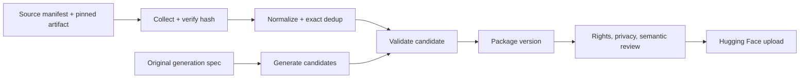

# Najd Datasets

[Public reconstruction audit](docs/public-reconstruction.md) · [Task generation roadmap](tasks/README.md) · [Contributing](CONTRIBUTING.md)

This repository holds **code and manifests** for collecting, cleaning, generating, and preparing Najd Research datasets. Large data and generated build artifacts stay outside Git. The published [Najd Benchmark](https://huggingface.co/datasets/najdresearch/najd-benchmark) is a historical candidate collection with structural certification; this repository does not claim its cases were semantically reviewed.

## Reproduce and inspect the public release

Start with [every published data point](docs/full-release.md). It fetches and verifies all 14 files at the pinned Hugging Face commit, writes a local case index, and reconciles all 6,089 case IDs against the 39-source ledger.

The [historical reproduction guide](docs/reproduction.md) rebuilds the published `cases.jsonl` and `quarantine.jsonl` byte for byte from the preserved pre-audit export. Its [plan](releases/2026.09.14/plan.json) pins all input and output hashes. The [source catalog](docs/source-catalog.md) has one page per source, including upstream links, revisions, recorded files, verification, rights claims, and limits. The catalog can be regenerated with:

```bash
uv run najd-datasets render-source-reference releases/2026.09.14/sources.json --output docs
```

For new datasets, follow the [source and case standard](docs/source-standard.md) and the machine-readable [source manifest schema](schemas/source-manifest.schema.json). Each new source needs a pinned file hash, rights record, collection method, transformation list, and review status.

The first complete upstream adapter is [Arabic Agent Eval](docs/sources/arabic-agent-eval.md). It downloads a pinned Git artifact, verifies its SHA-256, transforms 51 cases, and checks its output against the published rows:

```bash
uv run najd-datasets reproduce-source sources/arabic-agent-eval.json --output build/arabic-agent-eval
```

The command also downloads a pinned public reference and compares every generated field with the published rows. Pass `--reference /path/to/published/cases.jsonl` to use a local copy. The [private extract dependency record](docs/private-extract-dependencies.md) and [review protocol](docs/review-protocol.md) describe what must be resolved before a trusted evaluation release.

The [paired MSA/Saudi tool-use adapter](docs/sources/paired-msa-saudi-tool-use.md) likewise reproduces 150 published rows from its pinned upstream release: `uv run najd-datasets reproduce-source sources/paired-msa-saudi-tool-use.json --output build/paired-msa-saudi-tool-use`.

The [IslamicFaithQA adapter](docs/sources/qcri-islamicfaithqa.md) rebuilds 3,804 upstream candidates and verifies the 476 cases selected into the public release: `uv run najd-datasets reproduce-source sources/islamic-faith-qa.json --output build/islamic-faith-qa`.

The [Arabic Function Calling](docs/sources/arabic-function-calling.md) and [ArabicRAGB](docs/sources/arabicragb.md) adapters each verify another 499 public rows from pinned upstream JSONL files. ArabicRAGB also checks the recorded review-copy transformation.

The [AraTruthfulQA adapter](docs/sources/humain-aratruthfulqa.md) checks the 500 selected public rows against 536 candidates from its pinned upstream JSONL file. The historical source ledger does not declare a license for this source, so its rights basis needs renewed review before any new release.

The [AraSafe adapter](docs/sources/arasafe.md) checks 300 selected public cases against the pinned human-written and synthetic upstream files. The two origins stay visible in case provenance.

The [MENA Values adapter](docs/sources/mena-values.md) verifies 500 public rows against its pinned Parquet source. Use `uv run --extra parquet najd-datasets reproduce-source sources/mena-values.json --output build/mena-values`.

Four further Parquet adapters reproduce the selected public rows from ARBML Quran/Hadith (500), SaudiIrony (257), Arabic Reading Comprehension (492 certified and 4 quarantined), and HUMAIN AraPro (363). AraPro applies one explicit historical content correction recorded in its manifest. Their source pages are linked from the [catalog](docs/source-catalog.md).

The Dialectal Arabic MMLU, ARBML Arabic dialect, hate speech, and dangerous prompt adapters account for another 391 selected rows from pinned Parquet files.

The [remaining-source guide](docs/remaining-source-reproduction.md) covers all 774 rows that previously lacked adapters. The complete source breakdown is 5,725 public rows reconstructed from pinned external inputs, 31 internal-copy rows reconstructed from a hash-checked private archive file, and 333 quarantined rows matched against a fresh extraction while the original extract remains missing.

## Pipeline



| Stage | Command | Output |
|---|---|---|
| Collect | `najd-datasets collect sources/original-demo.json --output build/collected.jsonl` | Source rows with row-level provenance and hashes |
| Clean | `najd-datasets clean build/collected.jsonl --output build/cleaned.jsonl` | Canonical cases, exact duplicates removed |
| Generate | `najd-datasets generate fixtures/specs/reminder-variants.json --output build/generated.jsonl` | Original synthetic candidates |
| Validate | `najd-datasets validate build/cleaned.jsonl` | Structural checks |
| Package | `najd-datasets package build/cleaned.jsonl --output build/release/demo-v1 --id demo --version v1` | Immutable candidate release folder |
| Review | `najd-datasets check-approval build/release/demo-v1 --approval local-approval.json --repo najdresearch/najd-benchmark` | Rights, privacy, semantic review and hash gate |
| Publish | `najd-datasets publish build/release/demo-v1 --approval local-approval.json --repo najdresearch/najd-benchmark` | Upload to `datasets/demo/v1/` if target is absent |

Install with `uv sync --extra dev`; run through `uv run najd-datasets ...`. `HF_TOKEN` or a local Hugging Face login is needed only for publication. The publish command never creates or overwrites a repository or version. `build/` and local approvals are ignored by Git.

Source manifests record origin, license, redistribution basis, split, and immutable revision. `sources/historical-najd-benchmark.json` pins the existing public collection as a **pending-rights historical input**; it is not an approved source for a new release. Hugging Face sources also require a full commit hash and file SHA-256. Collection does not imply publication rights. Cleaning normalizes whitespace and removes only exact prompt-plus-answer duplicates; it does not fix labels or silently merge conflicts. Generation is deterministic; cases omit review annotations and specs carry their own rights record. Package cards remain candidates. Publication requires a separate approval JSON with `reviewer`, `reviewed_at`, `rights_approved`, `privacy_approved`, `semantic_review_approved`, `target_repo`, `dataset_id`, `version`, and `cases_sha256`; all approvals must be true, source rights statuses must be approved, and the hash must match. Keep that approval file outside Git.

The recovered historical workflow lives in a private preservation archive. Its collection, cleaning, and selection scripts informed this structure. They are historical evidence, not copied wholesale: the source bundle includes unreviewed cases and source-specific permissions. The corresponding [public release card](https://huggingface.co/datasets/najdresearch/najd-benchmark) says semantic review was not performed.

## Next gate

Choose one narrow Saudi/Arabic decision task, make a source manifest with verified rights and a pinned artifact, write a source-specific adapter if its schema differs, and review a small sample. Freeze the case set and analysis before creating a held-out evaluation split.

## Sources

- [Hugging Face snapshot download](https://huggingface.co/docs/huggingface_hub/package_reference/file_download)
- [Hugging Face upload API](https://huggingface.co/docs/huggingface_hub/package_reference/hf_api)
- [Published Najd Benchmark](https://huggingface.co/datasets/najdresearch/najd-benchmark)

## Standalone source publications

See [published legacy cases and Arabic riddles](docs/standalone-publications.md) for the two new Hugging Face datasets and reproducible collection commands.

Current public datasets omit review annotations. See the [metadata migration](docs/metadata-migration.md) for new revisions, checksums and historical compatibility.
