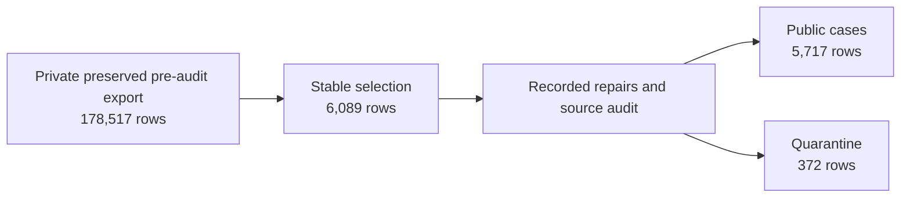

# Reproduce the 2026.09.14 case files

> Update: the [public release builder](public-release-builder.md) now reconstructs all 6,089 case records without private inputs or target case downloads. Earlier dependency descriptions below document the historical path. Missing original extract/authoring evidence and unverified redistribution permissions remain distinct from reproducible case content.


> Historical provenance and original pinned artifacts are described below. The 31 selected legacy cases and 333 fresh questions are now public: see [standalone publications](standalone-publications.md). Current public revisions omit review annotations: see [metadata migration](metadata-migration.md). Availability of those subsets does not yet establish a complete end-to-end public rebuild.

The public benchmark has 5,717 case rows and 372 quarantined rows. This procedure rebuilds both files **byte for byte** from the preserved pre-audit export. It does not recreate that export from every original website and dataset, and it does not provide a new semantic or rights review.



## Evidence and inputs

The original workflow is preserved in a private archive. The public output is pinned to [Hugging Face commit `cb30c1c9e46c62f691380c3269885cdb8f22f52b`](https://huggingface.co/datasets/najdresearch/najd-benchmark/tree/cb30c1c9e46c62f691380c3269885cdb8f22f52b). The [source ledger](../releases/2026.09.14/sources.json) and [plan](../releases/2026.09.14/plan.json) are copied or reconstructed from that release and checked by hash.

| Artifact | Rows | SHA-256 |
|---|---:|---|
| Preserved `exports/20260906-cleaned-not_reviewed/cases.jsonl` | 178,517 | `a6dbfcabaaa0eb2945bcd4b0c978afccd3e038e44103cbc017eb7af4cb8fa5a6` |
| Selected small suite | 6,089 | `ae9fc3e8f176a0b3024274993304fd55a61ec42ebef1c0c9402f4b8aa433721e` |
| Published `cases.jsonl` | 5,717 | `b8b52ded0f6731b7a4764a90476edfe643f46d6a286096bab02b7ed189af94f6` |
| Published `quarantine.jsonl` | 372 | `5b108a254466d621da41e53acfa5b6302b310c4f9f80d8e87124d605cbfc5ed8` |

## Run

Install `uv` and `zstd`. Download the nine archive chunks into one directory without renaming them. The script streams one file out of the archive and checks its SHA-256; it does not unpack the full archive.

```bash
uv sync --extra dev
scripts/extract-historical-input.sh "/path/to/2026-09-14" build/historical-input.jsonl
uv run najd-datasets reproduce-historical build/historical-input.jsonl --output build/reproduced-2026.09.14
```

The command checks the input, selected suite, public cases, quarantine, and source-ledger hashes and exits with an error on any mismatch. It refuses a nonempty output directory. The output includes `reproduction-report.json`.

## What the historical transformation did

The selector keeps the first occurrence of each exact track/category/prompt/answer identity, ranks cases by stable SHA-256 within category, keeps at most 500 per category, and sorts by track and ID. The audit applies the explicit [plan](../releases/2026.09.14/plan.json): six source revision corrections, one source rename, 997 derived-copy field renames, 29 empty-tag removals, 61 zero answer-key restorations, and one reviewed content correction. It quarantines cases whose exact source link could not be verified, cases containing Unicode replacement characters, and cases without an expected answer. The code stores the repair rules; output hashes catch any divergence.

## Boundary of this claim

The original upstream collection cannot yet be replayed end to end: the archived upstream builder referenced a private authorized extract that is absent from the preserved bundle. The helper scripts and pinned source references are historical evidence, but source-specific collectors for all 39 sources have not been reconstructed. This reproduction covers the two core JSONL row files; it does not claim byte identity for all release metadata or Parquet files. The release's recorded `permission-on-file` status is not independent proof of redistribution rights. No case-level semantic review was performed. Consult the [source catalog](source-catalog.md) before using a source in a new release.
