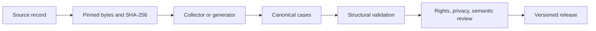

# Source and case standard

Every dataset starts with a source record and ends with an immutable candidate release. A source record says where the bytes came from, which exact bytes were used, what changed, and who reviewed them.

| Field | Rule |
|---|---|
| `schema_version` | `1`; change this when the contract changes. |
| `id`, `origin` | Stable source identity and human-readable origin. |
| `kind`, `collection_method` | `local`/`local_jsonl` or `huggingface`/`huggingface_jsonl`. |
| `path` or `repo_id` + `file` | Exact artifact location. |
| `revision`, `sha256` | Full Hub commit for Hugging Face; SHA-256 is mandatory for every source. |
| `license`, `redistribution_basis`, `rights_status` | License text, specific basis for reuse, and `approved`, `pending`, or `blocked`. |
| `split` | Intended partition. Keep sealed evaluation data outside this repo. |
| `transformations` | Ordered names of the operations applied after collection. |

Use [the source JSON Schema](../schemas/source-manifest.schema.json) and [case JSON Schema](../schemas/case.schema.json) when writing adapters. The CLI also enforces the required source fields and verifies bytes before collection. A collector must emit a manifest with its input digest and row-level provenance. Never silently repair a label: store each case-specific change in a reviewed patch, and pin the resulting output hash.

The generic cleaner only normalizes whitespace and removes exact prompt-plus-answer duplicates. Source-specific adapters should live under `src/najd_datasets/`, have a small fixture, document their input fields and mapping, and record the upstream revision and license. Keep development, validation, and held-out cases separated before tuning prompts or models. `package` builds a candidate; `publish` requires a separate local approval file that binds rights, privacy, semantic review, destination, version, and the final SHA-256. Do not commit that approval or private inputs.

The [historical source catalog](source-catalog.md) records what is known for each source in the existing public release. It is a reference, not a claim that all upstream collection adapters already exist.
